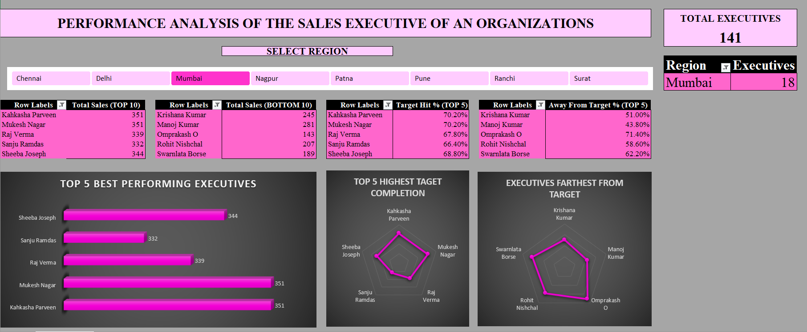

# Sales Department Performance Analysis Dashboard

An interactive Excel dashboard project designed to analyze and visualize the performance of sales executives from various regions across the nation. This tool enables data-driven decisions to improve productivity and address performance issues among underperforming employees.

---

## Project Overview

Achieving targets is essential for any Sales Department. This Excel-based dashboard provides data-driven insights into the performance of sales executives, enabling the organization to take necessary steps to increase productivity and take action against less productive employees.

---

## Features & Insights

- **Interactive Dashboard** — Analyze performance using dynamic slicers and charts  
- **Region-Specific Views** — Separate dashboards for different regions  
- **KPI Monitoring** — Track key metrics such as sales achievement, productivity, and regional performance

---

## Tools & Techniques Used

- Microsoft Excel (.xlsm format)
- Pivot Tables & Pivot Charts
- Slicers & Filters
- Conditional Formatting & Heatmaps
- Formulas: `COUNTIF`, `AVERAGEIFS`, `COUNTA`, `IF`

---

## Getting Started

1. Clone or download this repository  
2. Open `Sales_Performance_Dashboard.xlsm` in Excel  
3. Enable **macros** if prompted  
4. Use slicers to explore performance data by:
   - Region  

---

## Dashboard Preview

